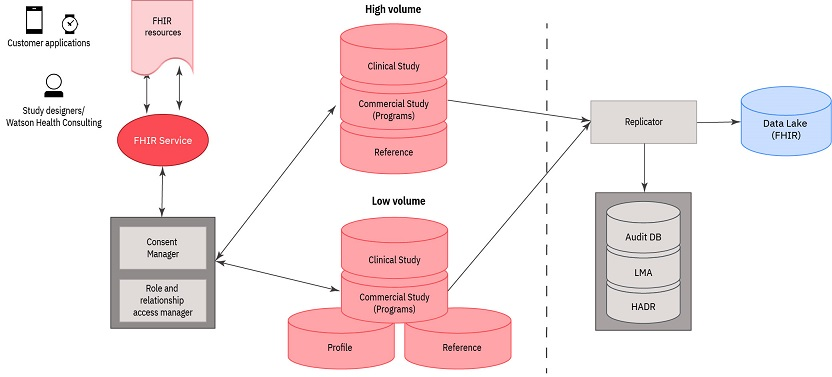

---

copyright:
  years: 2017, 2018
lastupdated: "2018-07-17"

---

{:shortdesc: .shortdesc}
{:new_window: target="_blank"}
{:tip: .tip}
{:pre: .pre}
{:codeblock: .codeblock}
{:screen: .screen}
{:javascript: .ph data-hd-programlang='javascript'}
{:java: .ph data-hd-programlang='java'}
{:python: .ph data-hd-programlang='python'}
{:swift: .ph data-hd-programlang='swift'} 

---

# Using the FHIR service

Fast Healthcare Interoperability Resources (FHIR) provides a framework to pass healthcare information between healthcare and medical applications. The {{site.data.keyword.wh_prodname_long}} FHIR service and FHIR REST API allow your site to ingest high-volume electronic data from multiple sources, including healthcare devices and mobile applications. After processing, FHIR data can be accessed by analysis and reporting tools such as Spark jobs and Hive queries and is available for clinical research.

## FHIR service overview

Use the FHIR service to upload FHIR-formatted data into the FHIR repository. The FHIR repository consists of multiple data stores that manage your FHIR data logically. FHIR resources are ingested either within the context of clinical studies or programs within commercial studies. Clinical studies are often run across multiple sites and commercial studies usually include multiple programs. For clinical studies, {{site.data.keyword.wh_prodname_short}} ingests data in the context of a specified {{site.data.keyword.study}}. For commercial programs, {{site.data.keyword.wh_prodname_short}} ingests data in the context of an application, or an "app". The commercial data, which includes the application name and version, can then be shared between multiple programs.

When a patient enrolls in either a clinical or commercial study, {{site.data.keyword.wh_prodname_short}} takes the following steps to help ensure that the patient is properly enrolled:

- The patient, or the patient's guardian, must grant permission (consent) for that patient's health information to be shared with user analysts and other personnel. For more information, see [Consent manager](/docs/services/DATA-SERVICES-FHIR/wp4h_gxp_c_consent_mgr.html).
<!-- - Assign a role to the patient (and the guardian, if applicable) to help ensure that the data is correctly processed and that only authorized users can view this patient's information. For more information, see [{{site.data.keyword.prodname_rram_first}} ](/docs/services/DATA-SERVICES-FHIR/wp4h_gxp_r_rram.html). 

  **Note:** Roles are assigned as defined by each client's business need for everyone who might view or manage any patient data, including practitioners, care managers, and administrators. -->
- As data comes into the FHIR repository, Consent Manager provides additional checks to help ensure that consent <!-- , role, and relationship information are -->information is still valid. 

[Figure 1](#wp4h_gxp_c_fhir_service__fig_hws_p2v_scb) provides an overview of how data flows from a customer application or device to the FHIR repository and then to the data replicator and data lake.

Figure 1.* FHIR data flow

 As shown in [Figure 1](#wp4h_gxp_c_fhir_service__fig_hws_p2v_scb), FHIR resources move through the {{site.data.keyword.wh_prodname_short}} pipeline in the following steps:

1. As data is written to the FHIR repository, the service calls the Consent Manager and Role and Relationship Access Manager services.
1. As the FHIR resources are uploaded, they are sent to the appropriate data stores, which are described in [FHIR resources and data stores](#wp4h_gxp_c_fhir_service__section_nk3_tgv_scb).
1. From the FHIR data stores, all data is replicated by the replicator to help ensure high availability and data resiliency.

## FHIR resources and data stores
<!-- {: #wp4h_gxp_c_fhir_service__section_nk3_tgv_scb} -->

For {{site.data.keyword.wh_prodname_short}}, the FHIR repository uses the following data stores: <!--  {: #wp4h_gxp_c_fhir_service__section_ylk_q4w_scb} -->

- Each FHIR repository includes four study data stores. Clinical studies and commercial programs each have high- and low-volume data stores.

    - High volume study data stores contain study or program data that can change frequently (multiple times daily).
    - Low volume study data stores contain study and data that does not change frequently, or that can be used retrospectively. Low-volume data includes FHIR resources such as CarePlan, Contract, Device, DeviceComponent, DeviceMetric, and MedicationOrder.

- Profile data contains the Patient FHIR resource and related information about the patient (that is, the patient's profile). To safeguard protected health information (PHI), the Patient resource cannot be accessed or used in predictive studies. However, data from the Profile data store can be used by the {{site.data.keyword.prodname_cro_dw}} service.
- Reference data store (Low volume) - Contains reference information for studies. Reference FHIR resources include Group, Medication, Organization, Practitioner, Questionnaire, Virtual, and Binary resources. Virtual Resources can include custom and other data that is not forwarded to the data lake.

### Supported FHIR resources
As shown in [Table 1](#wp4h_gxp_c_fhir_service__table_ckk_scb_hbb), {{site.data.keyword.wh_prodname_short}} supports several resource types that are defined by the FHIR DSTU2 specification.

<table id="wp4h_gxp_c_fhir_service__table_ckk_scb_hbb">
<caption>Table 1. Supported FHIR resources</caption><colgroup></colgroup>
<thead style="text-align:center; vertical-align:top">
<tr>
<th id="d3380e172">FHIR Resource Type</th>
<th id="d3380e175">Meaning</th>
</tr>
</thead>
<tbody style="vertical-align:top"; text-align:left">
<tr>
<td headers="d3380e172">Binary</td>
<td headers="d3380e175">Binary information that is provided from documents such as PDFs or images.</td>
</tr>
<tr>
<td headers="d3380e172">CarePlan</td>
<td headers="d3380e175">Patient care plan details.</td>
</tr>
<tr>
<td headers="d3380e172">Communication</td>
<td headers="d3380e175">An invitation to join a study or program as a practitioner, patient, or
administrator.</td>
</tr>
<tr>
<td headers="d3380e172">Contract</td>
<td headers="d3380e175">Patient consent information.</td>
</tr>
<tr>
<td headers="d3380e172">Device</td>
<td headers="d3380e175">A device that supports input such as a smartphone or computer, or a medical device such as an
inhaler or glucose monitor.</td>
</tr>
<tr>
<td headers="d3380e172">DeviceComponent</td>
<td headers="d3380e175">A mobile application on a device.</td>
</tr>
<tr>
<td headers="d3380e172">DeviceMetric</td>
<td headers="d3380e175">Quantitative or qualitative device measurements or status. User assigned.</td>
</tr>
<tr>
<td headers="d3380e172">Group</td>
<td headers="d3380e175">A Research Study group or Research Study definition.</td>
</tr>
<tr>
<td headers="d3380e172">Location</td>
<td headers="d3380e175">The residential location of a patient, guardian, or practitioner. Required to help ensure
privacy and consent rules for a country or other region.</td>
</tr>
<tr>
<td headers="d3380e172">Medication</td>
<td headers="d3380e175">Identification and definition of a medication.</td>
</tr>
<tr>
<td headers="d3380e172">MedicationAdministration</td>
<td headers="d3380e175">Event when a patient consumes or is administered medication (such as swallowing a pill or
using an inhaler).</td>
</tr>
<tr>
<td headers="d3380e172">MedicationOrder</td>
<td headers="d3380e175">Order (prescription) for a supply of a medication and administration instructions.</td>
</tr>
<tr>
<td headers="d3380e172">MedicationStatement</td>
<td headers="d3380e175">A record of the medication that is consumed by a patient.</td>
</tr>
<tr>
<td headers="d3380e172">Observation</td>
<td headers="d3380e175">Patient measurements and other measurements or basic information: <ul id="wp4h_gxp_c_fhir_service__ul_uq4_mq5_xcb">
<li>Patient height and weight </li>
<li>Device observation </li>
<li>Weather information</li>
</ul>
</td>
</tr>
<tr>
<td headers="d3380e172">Organization</td>
<td headers="d3380e175">Healthcare organization or clinical research organization, or organization site
information.</td>
</tr>
<tr>
<td headers="d3380e172">Patient</td>
<td headers="d3380e175">Patient demographics.</td>
</tr>
<tr>
<td headers="d3380e172">Person</td>
<td headers="d3380e175">Name, address, and other information about a patient, practitioner, or other user.</td>
</tr>
<tr>
<td headers="d3380e172">Practitioner</td>
<td headers="d3380e175">Researcher, medical or general wellness practitioner.</td>
</tr>
<tr>
<td headers="d3380e172">Questionnaire</td>
<td headers="d3380e175">Structured set of questions for collecting patient information.</td>
</tr>
<tr>
<td headers="d3380e172">QuestionnaireResponse</td>
<td headers="d3380e175">List of answers in response to a questionnaire.</td>
</tr>
<tr>
<td headers="d3380e172">RelatedPerson</td>
<td headers="d3380e175">A caregiver (guardian or third party) who is responsible for a minor or non-competent
adult.</td>
</tr>
</tbody>
</table>

A number of resource types require specific attributes or extension elements for the server to correctly process the resource. [Table 2](#wp4h_gxp_c_fhir_service__table_ghw_mxq_ycb) outlines the resources for which additional elements are needed. Resources that are not listed do not use elements that are outside of the base FHIR DSTU2 specification.

<table id="wp4h_gxp_c_fhir_service__table_ghw_mxq_ycb">
<caption>Table 2. Resources that require attributes or extension elements</caption>
<thead style="text-align:center; vertical-align:top">
<tr>
<th id="d3380e418">ResourceType</th>
<th id="d3380e421">appName</th>
<th id="d3380e424">appVersion Number</th>
<th id="d3380e427">Composite Keys</th>
<th id="d3380e430">PatientID</th>
<th id="d3380e434">SiteID</th>
<th id="d3380e437">StudyID</th>
</tr>
</thead>
<tbody style="text-align:left; vertical-align:top">
<tr>
<td headers="d3380e418">Patient</td>
<td headers="d3380e421"> </td>
<td headers="d3380e424"> </td>
<td headers="d3380e427"> </td>
<td style="text-align:center" headers="d3380e430">X</td>
<td style="text-align:center" headers="d3380e434">X</td>
<td style="text-align:center" headers="d3380e437">X</td>
</tr>
<tr>
<td headers="d3380e418">RelatedPerson</td>
<td headers="d3380e421"> </td>
<td headers="d3380e424"> </td>
<td headers="d3380e427"> </td>
<td style="text-align:center" headers="d3380e430">X</td>
<td headers="d3380e434"> </td>
<td headers="d3380e437"> </td>
</tr>
<tr>
<td headers="d3380e418">Contract</td>
<td style="text-align:center" headers="d3380e421">X</td>
<td style="text-align:center" headers="d3380e424">X</td>
<td headers="d3380e427"> </td>
<td style="text-align:center" headers="d3380e430">X</td>
<td style="text-align:center" headers="d3380e434">X</td>
<td style="text-align:center" headers="d3380e437">X</td>
</tr>
<tr>
<td headers="d3380e418">CarePlan</td>
<td style="text-align:center" headers="d3380e421">X</td>
<td style="text-align:center" headers="d3380e424">X</td>
<td headers="d3380e427"> </td>
<td style="text-align:center" headers="d3380e430">X</td>
<td style="text-align:center" headers="d3380e434">X</td>
<td style="text-align:center" headers="d3380e437">X</td>
</tr>
<tr>
<td headers="d3380e418">Communication</td>
<td headers="d3380e421"> </td>
<td headers="d3380e424"> </td>
<td headers="d3380e427"> </td>
<td headers="d3380e430"> </td>
<td headers="d3380e434"> </td>
<td style="text-align:center" headers="d3380e437">X</td>
</tr>
<tr>
<td headers="d3380e418">MedicationOrder</td>
<td style="text-align:center" headers="d3380e421">X</td>
<td style="text-align:center" headers="d3380e424">X</td>
<td style="text-align:center" headers="d3380e427"> </td>
<td style="text-align:center" headers="d3380e430">X</td>
<td style="text-align:center" headers="d3380e434">X</td>
<td style="text-align:center" headers="d3380e437">X</td>
</tr>
<tr>
<td headers="d3380e418">DeviceMetric</td>
<td style="text-align:center" headers="d3380e421">X</td>
<td style="text-align:center" headers="d3380e424">X</td>
<td headers="d3380e427"> </td>
<td style="text-align:center" headers="d3380e430">X</td>
<td style="text-align:center" headers="d3380e434">X</td>
<td style="text-align:center" headers="d3380e437">X</td>
</tr>
<tr>
<td headers="d3380e418">Medication</td>
<td headers="d3380e421"> </td>
<td headers="d3380e424"> </td>
<td headers="d3380e427"> </td>
<td headers="d3380e430"> </td>
<td headers="d3380e434"> </td>
<td style="text-align:center" headers="d3380e437">X</td>
</tr>
<tr>
<td headers="d3380e418">Observation (Low-Volume)</td>
<td style="text-align:center" headers="d3380e421">X</td>
<td style="text-align:center" headers="d3380e424">X</td>
<td headers="d3380e427"> </td>
<td style="text-align:center" headers="d3380e430">X</td>
<td style="text-align:center" headers="d3380e434">X</td>
<td style="text-align:center" headers="d3380e437">X</td>
</tr>
<tr>
<td headers="d3380e418">Observation (High Volume)</td>
<td style="text-align:center" headers="d3380e421">X</td>
<td style="text-align:center" headers="d3380e424">X</td>
<td style="text-align:center" headers="d3380e427">X</td>
<td style="text-align:center" headers="d3380e430">X</td>
<td style="text-align:center" headers="d3380e434">X</td>
<td style="text-align:center" headers="d3380e437">X</td>
</tr>
<tr>
<td headers="d3380e418">Questionnaire</td>
<td headers="d3380e421"> </td>
<td headers="d3380e424"> </td>
<td headers="d3380e427"> </td>
<td headers="d3380e430"> </td>
<td headers="d3380e434"> </td>
<td style="text-align:center" headers="d3380e437">X</td>
</tr>
<tr>
<td headers="d3380e418">ErrorLog (Virtual Resource)</td>
<td style="text-align:center" headers="d3380e421">X</td>
<td style="text-align:center" headers="d3380e424">X</td>
<td headers="d3380e427"> </td>
<td style="text-align:center" headers="d3380e430">X</td>
<td style="text-align:center" headers="d3380e434">X</td>
<td style="text-align:center" headers="d3380e437">X</td>
</tr>
<tr>
<td headers="d3380e418">MedicationAdministration</td>
<td style="text-align:center" headers="d3380e421">X</td>
<td style="text-align:center" headers="d3380e424">X</td>
<td style="text-align:center" headers="d3380e427">X</td>
<td style="text-align:center" headers="d3380e430">X</td>
<td style="text-align:center" headers="d3380e434">X</td>
<td style="text-align:center" headers="d3380e437">X</td>
</tr>
<tr>
<td headers="d3380e418">MedicationStatement</td>
<td style="text-align:center" headers="d3380e421">X</td>
<td style="text-align:center" headers="d3380e424">X</td>
<td style="text-align:center" headers="d3380e427">X</td>
<td style="text-align:center" headers="d3380e430">X</td>
<td style="text-align:center" headers="d3380e434">X</td>
<td style="text-align:center" headers="d3380e437">X</td>
</tr>
<tr>
<td headers="d3380e418">QuestionnaireResponse</td>
<td style="text-align:center" headers="d3380e421">X</td>
<td style="text-align:center" headers="d3380e424">X</td>
<td style="text-align:center" headers="d3380e427">X</td>
<td style="text-align:center" headers="d3380e430">X</td>
<td style="text-align:center" headers="d3380e434">X</td>
<td style="text-align:center" headers="d3380e437">X</td>
</tr>
<tr>
<td headers="d3380e418">Location</td>
<td style="text-align:center" headers="d3380e421">X</td>
<td style="text-align:center" headers="d3380e424">X</td>
<td headers="d3380e427"> </td>
<td headers="d3380e430"> </td>
<td headers="d3380e434"> </td>
<td headers="d3380e437"> </td>
</tr>
</tbody>
</table>

### FHIR extension URIs
If you use any of the following extensions, you must use the associated URI.

- appName - `http://www.ibm.com/watsonhealth/fhir/extensions/whc-lsf/r1/appName` (commercial programs only)
- appVersionNumber - `http://www.ibm.com/watsonhealth/fhir/extensions/whc-lsf/r1/appVersionNumber` (commercial programs only)
- intIdentifier - `http://www.ibm.com/watsonhealth/fhir/extensions/whc-lsf/r1/intIdentifier` (Contract resource only)
- PatientID - `http://www.ibm.com/watsonhealth/fhir/extensions/whc-lsf/1.0/patientid`
- SiteID - `http://www.ibm.com/watsonhealth/fhir/extensions/whc-lsf/1.0/siteID` (clinical studies only)
- StudyID - `http://www.ibm.com/watsonhealth/fhir/extensions/whc-lsf/1.0/studyid`

**Notes**
- appName and appVersionNumber are only required for commercial programs.
- SiteId is only required for clinical studies.
- The Contract resource includes multiple consent types (cloudConsent, shareDataStatement, and termsOfUse). All consent types for the Contract resource also require intIdentifier. When you register a practitioner, the termsOfUse consent type does not use patientID, AppName, or AppVersionNumber.
- For high-volume, study scoped Observation resources, the composite key is `http://www.ibm.com/watsonhealth/fhir/extensions/whc-lsf/r1/ck/ptnIDrsrceNMsiteIDstdID`.
- For MedicationAdministration, the composite key is `http://www.ibm.com/watsonhealth/fhir/extensions/whc-lsf/r1/ck/ptnIDsiteIDstdID`.

For {{site.data.keyword.wh_prodname_short}}, FHIR resource type and resource name pairs are sorted into high and low volume data stores. Resources are stored in different data stores to provide efficient searching, retrieval, and backup capabilities. As shown in the following tables, the FHIR resource names can affect where some resources are stored. These tables show examples of resource names, but the actual resource names depend on your site's requirements.

High-volume study data (clinical studies or commercial programs) includes data that is directly related to a study or program that can change frequently. For example, the resource is updated every time that a medical device is activated, or a patient responds to a daily questionnaire. High-volume resources require compound keys to allow for indexing (for faster search and retrieval).

<table id="wp4h_gxp_c_fhir_service__table_fdy_5nw_scb">
<caption>Table 3. High-volume study data</caption><colgroup></colgroup>
<thead style="text-align:center; vertical-align:top">
<tr>
<th id="d3380e909"; style="width:40%">FHIR Resource Type</th>
<th id="d3380e912"; style="width:40%"">Example Resource Name</th>
</tr>
</thead>
<tbody style="text-align:left; vertical-align:top">
<tr>
<td headers="d3380e909">MedicationAdministration</td>
<td headers="d3380e912">InhalationEvent</td>
</tr>
<tr>
<td headers="d3380e909">MedicationStatement</td>
<td headers="d3380e912">ScheduledEvents</td>
</tr>
<tr>
<td headers="d3380e909">Observation (Device)</td>
<td headers="d3380e912">MedicalDeviceObservation</td>
</tr>
<tr>
<td headers="d3380e909">Observation (Device)</td>
<td headers="d3380e912">MobileDeviceAppObservation</td>
</tr>
<tr>
<td headers="d3380e909">Observation (Device)</td>
<td headers="d3380e912">MobileDeviceObservation</td>
</tr>
<tr>
<td headers="d3380e909">QuestionnaireResponse</td>
<td headers="d3380e912">SurveyResponse</td>
</tr>
</tbody>
</table>

Low-volume study data (clinical studies or commercial programs) includes data that is directly related to a study or program that is not expected to change frequently. For example, while the response to a daily survey question is recorded daily, the question itself does not generally change (How are you feeling today?).

<table id="wp4h_gxp_c_fhir_service__table_xcy_xnw_scb">
<caption>Table 4. Low-volume study data</caption><colgroup></colgroup>
<thead style="text-align:center; vertical-align:top">
<tr>
<th id="d3380e993"style="width:40%">FHIR Resource Type</th>
<th id="d3380e996"style="width:40%">Example Resource Name</th>
</tr>
</thead>
<tbody style="text-align:left; vertical-align:top">
<tr>
<td headers="d3380e993">CarePlan</td>
<td headers="d3380e996">CarePlan</td>
</tr>
<tr>
<td headers="d3380e993">Communication</td>
<td headers="d3380e996">Invitation</td>
</tr>
<tr>
<td headers="d3380e993">Contract</td>
<td headers="d3380e996">Consent</td>
</tr>
<tr>
<td headers="d3380e993">DeviceMetric</td>
<td headers="d3380e996">UserPreference</td>
</tr>
<tr>
<td headers="d3380e993">Medication</td>
<td headers="d3380e996">Medication</td>
</tr>
<tr>
<td headers="d3380e993">MedicationOrder</td>
<td headers="d3380e996">Prescription</td>
</tr>
<tr>
<td headers="d3380e993">Observation (Device)</td>
<td headers="d3380e996">MedicalDevicePairingObservation</td>
</tr>
<tr>
<td headers="d3380e993">Observation (Patient)</td>
<td headers="d3380e996">ParticipantObservation (Height)</td>
</tr>
<tr>
<td headers="d3380e993">Observation (Patient)</td>
<td headers="d3380e996">ParticipantObservation (Weight)</td>
</tr>
<tr>
<td headers="d3380e993">Questionnaire</td>
<td headers="d3380e996">SurveyQuestion</td>
</tr>
</tbody>
</table>

Profile data is data that is directly related to a patient or practitioner. The RelatedPerson resource creates a relationship between minors or non-competent adults and their caregivers. For a minor, the RelatedPerson relationship expires when the minor reaches the age of majority (which depends on the patient's location). For a non-competent adult, the relationship does not explicitly expire.

<table id="wp4h_gxp_c_fhir_service__table_qmk_znw_scb">
<caption>Table 5. Profile data</caption><colgroup></colgroup>
<thead style="text-align:center; vertical-align:top">
<tr>
<th id="d3380e1112"style="width:40%">FHIR Resource Type</th>
<th id="d3380e1115"style="width:40%">Example Resource Name</th>
</tr>
</thead>
<tbody style="text-align:left; vertical-align:top">
<tr>
<td headers="d3380e1112">Patient</td>
<td headers="d3380e1115">Participant</td>
</tr>
<tr>
<td headers="d3380e1112">Person</td>
<td headers="d3380e1115">Profile</td>
</tr>
<tr>
<td headers="d3380e1112">Practitioner</td>
<td headers="d3380e1115">DashboardUser</td>
</tr>
<tr>
<td headers="d3380e1112">RelatedPerson</td>
<td headers="d3380e1115">Caregiver</td>
</tr>
</tbody>
</table>

Reference data is not directly related to a study or patient, but provides background information. The high-volume reference data resources require compound keys, and are therefore better suited to a high-volume data store.

<table id="wp4h_gxp_c_fhir_service__table_bwq_14w_scb">
<caption>Table 6. High-volume reference data</caption><colgroup></colgroup>
<thead style="text-align:center; vertical-align:top">
<tr>
<th id="d3380e1176"; style="width:40%">FHIR Resource Type</th>
<th id="d3380e1179"; style="width:40%">Example Resource Name</th>
</tr>
</thead>
<tbody style="text-align:left; vertical-align:top">
<tr>
<td headers="d3380e1176">Location</td>
<td headers="d3380e1179">Location</td>
</tr>
<tr>
<td headers="d3380e1176">Observation (Weather)</td>
<td headers="d3380e1179">WeatherData</td>
</tr>
</tbody>
</table>

Low-volume reference data includes background information that does not change frequently. Virtual resources are generally stored in the low-volume reference data store.

**Note:** The ConfigParam resource is a virtual resource that describes the resources to add to the {{site.data.keyword.prodname_pde_caps}} service.

<table id="wp4h_gxp_c_fhir_service__table_ykv_b4w_scb">
<caption>Table 7. Low-volume reference data</caption><colgroup></colgroup>
<thead style="text-align:center; vertical-align:top">
<tr>
<th id="d3380e1226"; style="width:40%">FHIR Resource Type</th>
<th id="d3380e1229"; style="width:40%">Example Resource Name</th>
</tr>
</thead>
<tbody style="text-align:left; vertical-align:top">
<tr>
<td headers="d3380e1226">ConfigParam (Virtual Resource)</td>
<td headers="d3380e1229">ConfigParams</td>
</tr>
<tr>
<td headers="d3380e1226">Contract</td>
<td headers="d3380e1229">ReferenceContract</td>
</tr>
<tr>
<td headers="d3380e1226">Device</td>
<td headers="d3380e1229">Inhaler</td>
</tr>
<tr>
<td headers="d3380e1226">Device</td>
<td headers="d3380e1229">MobileDevice</td>
</tr>
<tr>
<td headers="d3380e1226">DeviceComponent</td>
<td headers="d3380e1229">MobileDeviceApp</td>
</tr>
<tr>
<td headers="d3380e1226">Group</td>
<td headers="d3380e1229">Program</td>
</tr>
<tr>
<td headers="d3380e1226">Group</td>
<td headers="d3380e1229">Study</td>
</tr>
<tr>
<td headers="d3380e1226">Organization</td>
<td headers="d3380e1229">CROName</td>
</tr>
<tr>
<td headers="d3380e1226">Organization</td>
<td headers="d3380e1229">CMOName</td>
</tr>
<tr>
<td headers="d3380e1226">Organization</td>
<td headers="d3380e1229">Site</td>
</tr>
</tbody>
</table>

For more information about the FHIR API, see FHIR API details](/docs/services/DATA-SERVICES-FHIR/wp4h_gxp_c_fhir_details.html).
